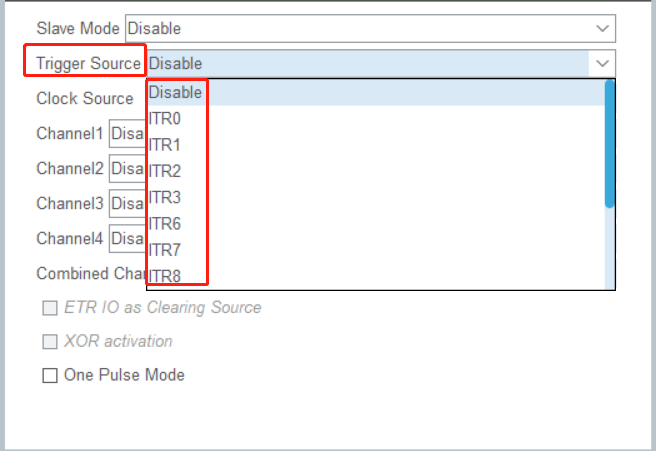
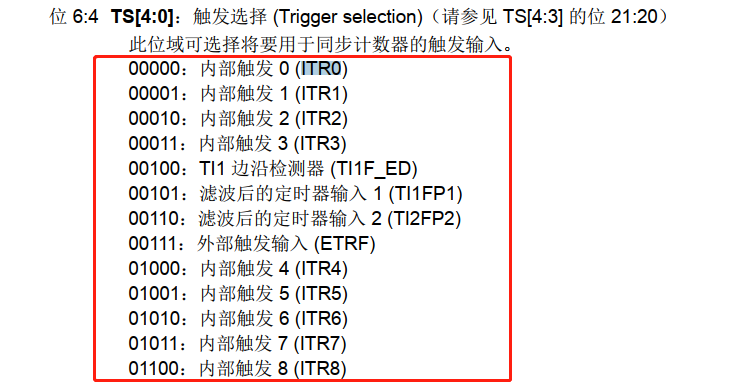
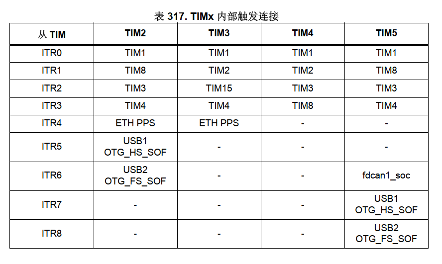
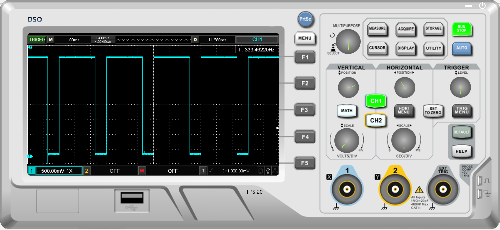

# 项目记录

## 环境搭建：

- 硬件平台：STM32H750XBH6
- 开发环境：STM32CubeMX V6.8.1+KEIL V5.28.0.0
- STM32H750固件版本：package V1.11.0
- 仿真下载驱动：ST-Link


# 18.通用定时器()


# Slave Mode(从模式)


定时器的"Slave Mode"（从模式）是指定时器作为从设备与其他主设备（通常是另一个定时器）进行同步工作的一种模式。

在微控制器中，有时需要多个定时器同时运行，并且它们之间需要同步，以确保它们在正确的时间执行特定的任务。这时就可以使用定时器的Slave Mode来实现同步。

在Slave Mode下，一个定时器作为主定时器，而其他定时器作为从定时器。从定时器会根据主定时器的时钟信号进行计数，并在特定事件发生时执行相应的操作。通过这种方式，多个定时器可以同步地工作，以满足复杂的定时要求。

具体的Slave Mode选项和功能会因不同的定时器型号和硬件平台而有所不同。一般情况下，您可以在定时器的配置寄存器中找到Slave Mode相关的设置选项，并根据需要设置主定时器和从定时器的关系、触发条件等。

使用定时器的Slave Mode功能可以帮助您实现精确的定时控制和同步，特别在需要多个定时器同时运行的应用中，这是一个非常有用的功能。

**external clock mode :**这种模式下，定时器的时钟源来自外部引脚，而不是内部时钟源。外部引脚可以提供定时器所需的时钟信号。定时器会根据外部时钟信号进行计数。

**reset mode**:在复位模式下，定时器在启动计数后，当外部触发事件（例如外部引脚的信号）到来时，定时器的计数值会被复位为预先设置的值。这种模式允许您在外部事件到来时重新开始计数。

**gated mode**:门控模式下，定时器的计数仅在外部事件激活（例如特定的外部引脚状态）时才会进行。当外部事件未激活时，定时器的计数将暂停。

**trigger mode**:触发模式下，外部事件会触发一个特定的操作，例如生成输出比较或产生更新事件。该模式允许您在外部事件到来时触发定时器生成特定的动作或输出。

**combined reset trigger mode**:这是一种结合了复位模式和触发模式的工作模式。外部事件可以同时用于复位计数器和触发特定操作。

# Trigger Source（触发源）



Trigger Source（触发源）是指用于触发STM32微控制器定时器（TIM）中的某些特定事件或操作的信号源。当配置了定时器的触发源后，触发事件发生时，定时器会根据该事件执行相应的操作，例如产生输出比较、更新计数值、启动/停止计数等。

在STM32定时器中，触发源可以是多种类型，具体取决于定时器的功能和配置。以下是一些常见的定时器触发源：

1. **外部触发源**：外部引脚的信号可以作为定时器的触发源。当外部引脚的信号满足特定条件（例如上升沿、下降沿等）时，触发器会触发定时器执行相应的操作。
2. **其他定时器**：一个定时器可以作为另一个定时器的触发源。当主定时器达到特定条件时，可以触发从定时器执行操作，实现定时器之间的同步和联动。
3. **软件触发源**：由软件编程触发定时器的特定操作，例如立即更新计数值或产生软件触发的输出比较。
4. **ADC触发源**：ADC（模数转换器）可以作为定时器的触发源，使得ADC转换在定时器的触发事件发生时启动。
5. **DMA触发源**：DMA（直接内存访问）可以作为定时器的触发源，使得DMA传输在定时器的触发事件发生时启动。







指定了定时器（TIM）所使用的时钟信号来源。定时器的计数操作和相关功能的正常工作都依赖于一个稳定的时钟信号。根据不同的应用需求和硬件配置，可以选择不同的时钟源来驱动定时器。

常见的定时器时钟源包括：

1. **内部时钟源**：一些STM32微控制器提供内部的RC振荡器或晶振作为定时器的时钟源。内部时钟源通常是系统时钟或低速时钟的分频信号。
2. **外部时钟源**：定时器可以使用来自外部晶振或其他外部信号的时钟源。外部时钟源可以提供更高的精度和稳定性，适用于需要精确定时的应用。
3. **主PLL时钟源**：某些STM32微控制器支持将主PLL（Phase-Locked Loop，锁相环）的输出作为定时器的时钟源。主PLL可以提供更高的时钟频率，适用于需要高速计数的应用。
4. **系统时钟源**：定时器可以使用系统时钟（SYSCLK）或系统时钟的分频信号作为时钟源。

1. **Internal Clock**（内部时钟）： 内部时钟是指STM32微控制器内部的RC振荡器或其他内部时钟源。在定时器中选择内部时钟作为时钟源时，定时器会使用来自内部时钟的时钟信号来进行计数操作。内部时钟通常不需要外部元件（如晶振）的支持，但其精度和稳定性可能相对较低，适用于一些不要求高精度的简单计时应用。
2. **ETR2**（外部触发输入2）： ETR2是STM32微控制器定时器的外部触发输入2。它允许通过外部引脚接收来自其他外部设备的触发信号，并用于触发定时器的特定操作。您可以根据应用需求配置ETR2触发源的触发条件和触发类型（例如上升沿触发、下降沿触发等）。
3. **ETR2 through Remap**（ETR2重映射）： "ETR2 through Remap"是一种功能，它允许将ETR2信号重新映射到不同的定时器或外设。通过重映射，您可以将ETR2信号连接到另一个定时器或外设的特定输入引脚，从而实现定时器之间的联动或与其他外设的连接。

channel(通道)


1. **Input Capture Direct Mode**（输入捕获直接模式）： 这是定时器输入捕获通道的一种工作模式，通常称为IC直接模式。在该模式下，输入捕获通道直接用于捕获外部信号的边沿（上升沿或下降沿），并将捕获的计数值存储在相关的寄存器中。
2. **Input Capture Direct Mode from Remap**（从重映射的输入捕获直接模式）： 这是定时器输入捕获通道重映射的一种工作模式。它允许将输入捕获通道从一个定时器重映射到另一个定时器或外设，从而实现更灵活的定时器资源分配。
3. **Output Compare No Output**（输出比较无输出）： 在该模式下，输出比较通道被配置为没有输出功能。定时器可以进行输出比较操作，但没有输出信号产生。
4. **Output Compare CH1**（输出比较通道1）： 这是定时器输出比较通道1的工作模式。在该模式下，通道1可以产生输出比较事件，并在比较匹配时产生特定的输出信号。
5. **PWM Generation No Output**（PWM生成无输出）： 在该模式下，PWM生成通道被配置为没有输出功能。定时器可以进行PWM生成操作，但没有输出信号产生。
6. **PWM Generation CH1**（PWM生成通道1）： 这是定时器PWM生成通道1的工作模式。在该模式下，通道1可以产生PWM信号，并通过比较值控制占空比。
7. **Forced Output CH1**（强制输出通道1）： 在该模式下，定时器通道1的输出被强制设置为特定的电平，不受定时器计数或外部触发的影响。

PWM（Pulse Width Modulation，脉冲宽度调制）和输出比较是定时器（TIM）在不同工作模式下的两种不同用途：

1. **PWM（脉冲宽度调制）**： PWM是一种用于产生模拟信号的技术，通常用于控制电机、灯光、电压等的输出。在PWM模式下，定时器的输出通道会周期性地产生一个方波信号。方波的高电平时间（脉冲宽度）由设定的比较值决定，高电平时间与周期的比值就是所谓的占空比。通过调整占空比，可以实现对输出信号的平均电平进行控制，从而控制所驱动的设备或器件的输出功率或强度。
2. **输出比较**： 输出比较是定时器的另一种工作模式，用于比较定时器的计数值与预先设定的比较值。当定时器的计数值达到或超过比较值时，会触发输出比较事件，可以选择在触发时产生特定的输出信号或执行其他特定的操作。输出比较通常用于控制事件的触发，例如控制外设的开关、产生特定的中断、或与其他外部设备进行同步。

总结区别：

- PWM是用于产生模拟信号的一种技术，通过调整脉冲宽度的占空比来控制输出信号的平均电平。
- 输出比较是用于比较定时器计数值和预设比较值的一种模式，用于触发事件和产生输出信号。


"PWM生成无输出"和"输出比较无输出"是两种定时器通道的不同工作模式，它们有以下区别：

1. **PWM生成无输出**： 在这种模式下，定时器通道被配置为执行PWM（脉冲宽度调制）生成操作，但没有实际的输出信号产生。定时器会按照设定的PWM周期和占空比计数，并根据设置的比较值控制高电平持续时间，但它不会在定时器通道引脚上产生实际的PWM输出。这种模式常用于在需要定时器执行PWM生成操作，但实际输出由其他外设或硬件控制的情况下。
2. **输出比较无输出**： 在这种模式下，定时器通道被配置为执行输出比较操作，但不会在定时器通道引脚上产生实际的输出信号。定时器会执行输出比较，当计数值与设置的比较值匹配时，会触发输出比较事件，但输出信号不会在通道引脚上反映出来。这种模式常用于需要触发输出比较事件，但实际输出由其他外设或硬件处理的情况下。

总结：

- PWM生成无输出：执行PWM生成操作，但没有在定时器通道引脚上产生实际的PWM输出。
- 输出比较无输出：执行输出比较操作，但没有在定时器通道引脚上产生实际的输出信号。

这两种模式都允许定时器执行特定的功能操作，但实际输出信号的产生由其他外设或硬件负责，这使得定时器的应用更加灵活和多样化。


输入捕获（Input Capture）是STM32微控制器定时器（TIM）的一种功能，用于测量外部信号的频率、脉宽和时间间隔等。输入捕获通过捕获外部信号的边沿（上升沿或下降沿）来记录定时器的计数值，从而提供对外部信号的精确时间测量。

以下是输入捕获的详细解释：

1. **工作原理**： 输入捕获通过将定时器的一个通道配置为输入捕获模式，然后连接到外部信号的引脚。当外部信号的边沿触发时，定时器会立即记录当前的计数值，并将其存储在相应的捕获寄存器中。
2. **应用**： 输入捕获广泛应用于测量外部信号的频率、脉宽和时间间隔。例如，您可以使用输入捕获来测量外部传感器输出的脉冲频率、PWM信号的脉宽、两个事件之间的时间间隔等。
3. **边沿触发**： 输入捕获可以配置为上升沿触发或下降沿触发。当配置为上升沿触发时，定时器记录外部信号上升沿的时间；当配置为下降沿触发时，定时器记录外部信号下降沿的时间。
4. **捕获寄存器**： 输入捕获的值会存储在定时器的捕获寄存器中。您可以读取这些寄存器的值来获取测量的计数值。
5. **计算**： 通过输入捕获得到的计数值，您可以使用适当的公式将其转换为实际测量值。例如，计算频率、脉宽、时间间隔等。
6. **多通道支持**： 一些STM32定时器支持多个输入捕获通道，这意味着您可以同时测量多个外部信号的特性。

输入捕获是定时器功能中非常有用且强大的一种，它允许您以微秒级的精度测量外部信号的时间特性，从而满足各种实时控制和测量需求。


# PWM(脉宽调制实验)舵机控制

舵机控制原理：

舵机是一种常用于控制角度位置的设备，它通常用于模型控制、机器人、遥控器和其他需要精确角度控制的应用中。舵机控制原理基于PWM（脉冲宽度调制）信号，并通过控制脉冲的宽度来实现对舵机位置的控制。

以下是舵机控制的基本原理：

1. **PWM信号**： 舵机接收PWM信号来控制其位置。PWM信号是一种周期性的方波信号，它的高电平时间（脉冲宽度）可以被调整。每个PWM周期包含一个高电平时间和一个低电平时间。
2. **控制角度**： 舵机的位置由脉冲宽度控制，通常情况下，脉冲宽度在0.5ms到2.5ms之间。通常，0.5ms脉冲表示最小角度位置，1.5ms脉冲表示中间位置，2.5ms脉冲表示最大角度位置。
3. **控制范围**： 舵机的控制范围可以因舵机型号而异，但一般情况下，舵机可以控制约180度的角度范围，即从最小角度到最大角度。
4. **更新频率**： 舵机的更新频率决定了其响应速度，通常以赫兹（Hz）表示。较高的更新频率可以提供更平滑和精确的控制，但同时也会占用更多的系统资源。
5. **PWM周期**： PWM周期是PWM信号的总周期，通常以微秒（μs）表示。在每个PWM周期内，脉冲宽度决定了舵机的角度位置。
6. **控制电路**： 舵机通常需要一个控制电路来产生PWM信号并将其发送到舵机的控制线（通常是信号线）。这个控制电路可以是微控制器、单片机、遥控器或其他控制设备。

舵机的工作原理简单而有效，通过调整PWM信号的脉冲宽度，可以精确控制舵机的角度位置。这使得舵机成为许多控制应用中的理想选择，从而实现精确的位置控制。


先试试卡看吧，我们给定周期为3ms吧,占空比从20%-80% N型变化

计算clk=240MHZ

3000us=(arr+1)*(psc+1)/240

我们给到arr=999       psc+1=3000*240/1000      psc+1=720    psc=719

# cubemx配置如下


生成代码后启动pwm 

CCR寄存器可以改变占空比

```
 HAL_TIM_PWM_Start(&htim5,TIM_CHANNEL_2);//初始化通道2
  HAL_TIM_PWM_Start(&htim5,TIM_CHANNEL_3);//初始化通道3
	 TIM5->CCR2 = 200 ;  
	 TIM5->CCR3 = 800 ; 
```

编写N型PWM   (代码片加入循环中)

```
 static uint16_t ccr2=200;
 static uint16_t Pulse_flag=1;			

		
		if(Pulse_flag==1)
		{
		   ccr2++;
			   if(ccr2>=800)
				  Pulse_flag=2;
			HAL_Delay(1);
		}
		else if(Pulse_flag==2)
		{
		   ccr2--;
			if(ccr2<=200)
			
			Pulse_flag=1;
			
			HAL_Delay(1);
		}
			
			 TIM5->CCR2 = ccr2; 
```

加上舵机检测ok;

总结：第一次使用给了5ms周期，使用舵机时周期较长 占空比范围10%-45%稳定，算下来高电平时间较长，周期3ms差不多，如果想要舵机转速快可以增加周期调小占空比范围，或者占空比延时快一点


